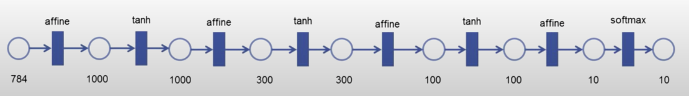
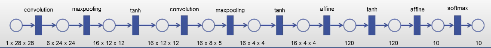
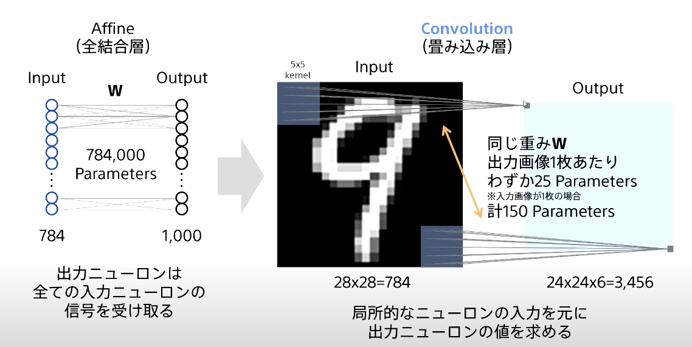

# ニューラルネットワーク設計の基礎

## 時間

2/2 18時ごろ,20時ごろ

## ニューラルネットワークの復習

脳の学習機能をコンピュータでシミュレーションする技術

神経細胞→ニューラルネットワーク(多層パーセプトロン)→ディープラーニング、の流れ

## 構成例1：DNN

上記のような関数の組み合わせで表現することができる
ここで用いた関数は、affine、tanh、softmaxである。

### 用語の説明

- affine 
    - 全結合層
    - y = W x
    - inputをx,outputをy,それぞれの結合の重みの行列をWとする
- tanh
    - 活性化関数の一種
    - 入力値を-1から1の範囲に制限する
- affineとtanh
    - 人工ニューロンを構成する
    - f(W x+b)
    - f:活性化関数tanh(非線形)
    - W x+b:affine(線形)
- softmax
    - 活性化関数の一種
    - 最終層の合計の確率を1に変換する

## 構成例2:CNN

画像認識で大きな成果をあげているニューラルネットワーク

全結合層の代わりにConvolutionとPoolingを用いる。

### 用語の説明

- Convolution
    - 畳み込み演算
    - 画像に対してフィルタによる畳み込み演算を行い、"加工された画像"を出力する
    - また、加工された画像を異なる複数のフィルタによって複数生成するのが一般的
- Pooling
    - ダウンサンプリングの処理
    - "解像度を下げた画像"を出力する
    - Poolingの例としてはMaxpooling

## AffineとConvolutionの比較

この図が全てか

Convolutionの特徴
- 1つのフィルター(カーネル)が1つのアフィン変換に対応する。
- 出力画像1枚のパラメータはフィルターのパラメータ"のみ"になる。
- フィルターにより局所的な接続を持つ。

## ニューラルネットワークの構成の確認：一層

Affineの場合：全結合層→活性化関数
Convolutionの場合：畳み込み層→(必要に応じて)プーリング層(ダウンサンプリング)→活性化関数

→これらを繰り返し配置して作成するのがニューラルネットワーク

## プーリング層の説明

画像を小領域ごとに分け、それぞれで何らかの値を求めることで圧縮する。
最大値を求める時はMaxPooling、平均値を求めるときはAveragePooling。

## ニューラルネットワークの設計法

- 中間層の層数、ニューロン数、活性化関数などに正解はない
- 解く問題の種類やデータ量に合わせて試行錯誤して設計する
    - 高い制度の実現
    - 少ない消費メモリと演算量
- 設計を自動化する試みもある

## 最後の活性化関数とロス関数

解きたい問題に合わせて最後の活性化関数とロス関数(ニューラルネットワークの学習の指標となるもの,この関数を最小化する)を設定する。

- 二値分類
    - 活性化関数：Sigmoid
        - 入力値の範囲は0.0~1.0の確率
    - 損失関数：BinaryCrossentropy
        - 出力と正解の要素ごとの交差エントロピーを計算
- 分類問題(カテゴリ認識など)
    - 活性化関数：Softmax
        - 入力値は合計が1.0となる0.0~1.0の確率
    - 損失関数：CategoricalCrossentropy
        - 出力と正解カテゴリインデックスとの交差エントロピーを計算
- 回帰問題(数値予測など)
    - 活性化関数：なし
    - 損失関数：SquaredError
        - 出力と正解の要素ごとの二乗誤差を計算
- (活性化関数とロス関数について調べる)