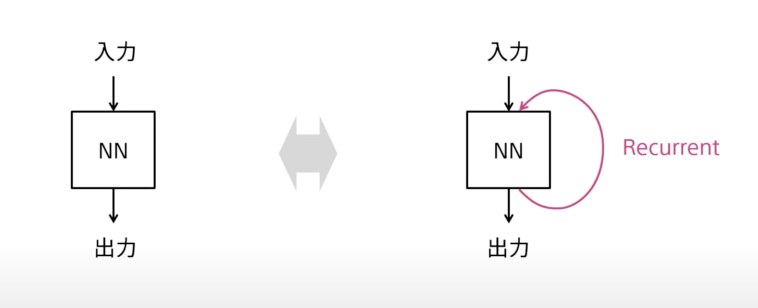

# RNNとは

## 時間

2/10 10時ごろ

## RNNとは？

左側が通常のニューラルネットワーク(Feed Forward Neural Networks,FFNN)
右側が今回のニューラルネットワーク(Recurrent Neural Networks,RNN)

RNNは時系列データの予測に用いられる。

## 時系列データの予測にて

### FFNNを用いる場合

時系列のデータをそれぞれ時間ごとに独立に予測を行う
時刻間の関連性を利用できない

### RNNを用いる場合

(詳しい実装)
前の時刻の出力を次の時刻の入力へと渡す
これにより時刻間の関連性を利用できる

## RNNの使い方

- 時系列の入力データから単一の出力を得る
    - 応用例：時系列データの認識など
- 単一の入力データから時系列の出力を得る
    - 応用例：画像へのキャプショニング
- 時系列の入力データの各時刻に対応する出力データを得る
    - 応用例：時系列データの時刻ごとの予測や認識
- 時系列の入力データから特徴を抽出し、そこから新たな時系列出力を得る
    - 応用例：機会翻訳、対話

## RNNの高い応用性

(要調査)

RNNはチューリング完全(コンピュータで実現できれば何でも実現することができる)なので、高い応用性を持つ

また、LSTMを使うとより実用的なプログラムを書くことができる